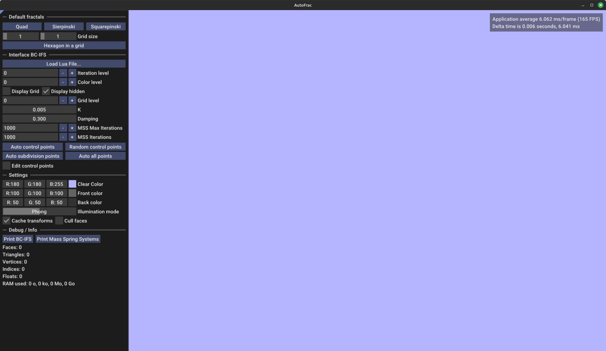
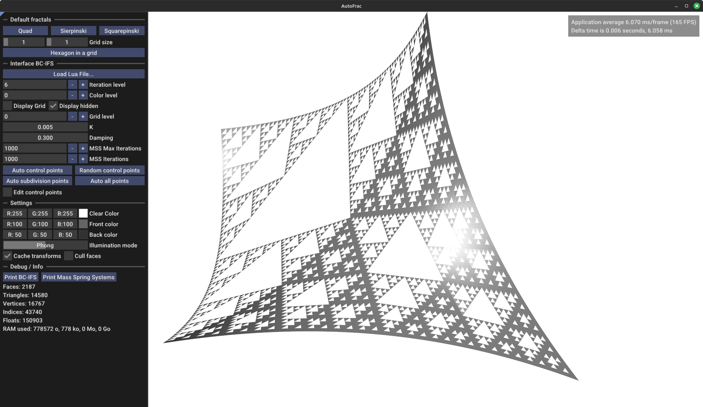
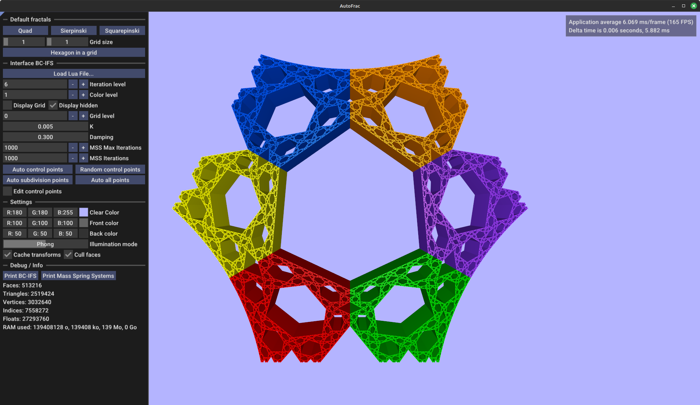
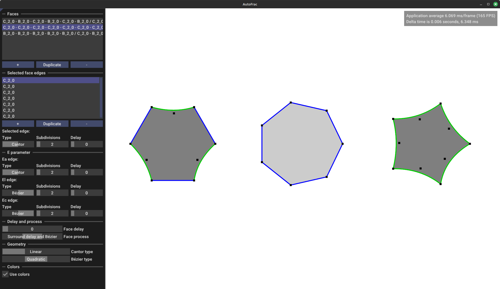

# AutoFrac

Software for CAD of lacunar fractal structures on Linux.

## How to build

You need to install some dependencies:
```bash
sudo apt install libglfw3-dev libglew-dev libgl-dev libfmt-dev libspdlog-dev libarmadillo-dev liblua5.4-dev 
```
Then you can build this project.
Replace `{NB_CORES}` by the number of cores to use to compile the project.
```bash
git clone https://github.com/borisbordeaux/AutoFrac.git
cd AutoFrac
mkdir build
cd build
cmake -DCMAKE_BUILD_TYPE=Release ..
make -j {NB_CORES}
```

## How to use

The main pipeline is:
- write a script defining the topology of a fractal structure.
- import it in the software to visualize the fractal.

### The script

The script, written in Lua, should describe the topology of a fractal with the BC-IFS model [[1](#1), [2](#2)].
Some example files are provided inside the `res/scripts/` folder.
A list of all available Lua functions relative to the BC-IFS model is provided [in a following section](#available-lua-functions).

### The interface

#### BC-IFS interface

When openning the software, it leads to the following window.



From this window, you can directly see default fractals in the software.
Here, for instance, is a quad that subdivides into 3 quads and a Sierpinski triangle.



This software also offers the possibility the see 3D colorful fractals, as demonstrated in the following picture.



#### Automatic conception interface

This software allows to conceive fractal faces by describing the fractal behavior of their edges.
See [[3](#3)] or [[4](#4)] for more theoretical information on how it is done.  
Press the `tab` key to switch between edit and render mode.  
Note that when returning to the render mode, if something has changed in edit mode, a new fractal is automatically constructed with the settings currently in the edit mode.



Note that this interface is still a work in progress and may change in the future.

### Available Lua functions

#### State
Create a state with a unique name and an internal dimension.
```Lua
state(stateName, internalDimension)
```

#### Internal transitions
Internal transitions are automatically created when creating a state.
Each internal dimension is accessible through an internal operator defined automatically.
```Lua
-- creating this state
state("example", 3)
-- automatically creates "intern_0", "intern_1" and "intern_2" transitions
```

#### Boundary
Create a boundary with a unique name from a state to another.
I recommand to name a boundary with `b{number}` in order to avoid conflict with other transition names.  
Note that the name should be unique only across all transitions of the current state.
```Lua
boundary(boundaryName, fromStateName, toStateName)
```

#### Subdivision
Create a subdivision with a unique name from a state to another.
I recommand to name a subdivision with `s{number}` in order to avoid conflict with other transition names.  
Note that the name should be unique only across all transitions of the current state.  
It is possible to specify a front and a back colors associated to this subdivision.
```Lua
subdivision(subdivisionName, fromStateName, toStateName [, frontColor[, backColor]])
```

#### Permutation
Create a permutation with a unique name from a state to another.
I recommand to name a permutation with `p{number}` in order to avoid conflict with other transition names.  
Note that the name should be unique only across all transitions of the current state.
```Lua
permutation(permutationName, fromStateName, toStateName)
```

#### Grid
Create a grid for a state with an array of figures.
A figure is an array of paths with eventually a stiffness value k and a length (see the examples).
A path is an array of transitions.  
Note that a path used in a grid should always lead to a 1-dimension element (usually a vertex, while it could also be a specific internal point of any state).  
Note also that such paths should only contain boundary or internal transitions.
Each array of paths in a figure is considered as a polyline where:
- each line gives a spring.
- each path (extremity of lines) gives a mass.

The grid is then used to build a mass spring system to automatically displace subdivision points.
```Lua
grid(stateName, figuresArray)
```

It's also possible to create a grid automatically from the boundary with the following function.
```Lua
gridFromBoundary(stateName)
```
In this case, the grid of each boundary state should have been defined with either the `grid()` or `gridFromBoundary()` function.

#### Space
Define a space for a state with an array of boundary or internal transitions of this state.  
Defining a space is useful to impose an order in control points when defining subdivision matrices. 
```Lua
space(stateName, arrayOfBoundaryOrInternalTransitions)
```

#### Primitive
Define a primitive for a state with an array of figures. A figure is an array of paths, and a path is an array of transitions.  
Note that a path used for a primitive should always lead to a 1-dimension element (usually a vertex, while it could also be a specific internal point of any state).  
Note that it is possible to use any operator in a path (as long as the path exists).
Each figure is considered as a face where:
- each path corresponds to a vertex of the face
- the vertices are interpreted in CCW order
```Lua
primitive(stateName, figuresArray)
```

#### Constraint
Define a constraint for a state between two paths starting from that state.  
Note that the ending state of each path should be the same to have a valid constraint.
```Lua
constraint(stateName, firstPath, secondPath)
```

#### Initial matrices
Define an initial matrix for a subdivision transition of a state with the values and a type.
The matrix is defined with an array of array of numbers, in row-major order.  
Note that the type must be either 'VAR' or 'CONST'
```Lua
initMat(stateName, subdivisionName, matrix, type)
```

### References

<a id="1">[1]</a>
GOUATY, Gilles. [*Modélisation géométrique itérative sous contraintes.*](https://core.ac.uk/download/pdf/147955210.pdf) 2010. Thèse de doctorat. École Polytechnique Fédérale de Lausanne.

<a id="2">[2]</a>
GENTIL, Christian, GOUATY, Gilles, et SOKOLOV, Dmitry. Geometric modeling of fractal forms for CAD. John Wiley & Sons, 2021.

<a id="3">[3]</a>
BORDEAUX, Boris et GENTIL, Christian. [*Automatic construction of fractal structures with locally controlled lacunarity.*](https://dspace.zcu.cz/bitstreams/a4fdeb1a-4486-4c5c-8597-16de0cd32303/download) In : Journal of WSCG. 2024.

<a id="4">[4]</a>
BORDEAUX, Boris. [*Conception automatique de structures lacunaires fractales.*](https://theses.hal.science/tel-05443346/) 2025. Thèse de doctorat. Université Bourgogne Europe.